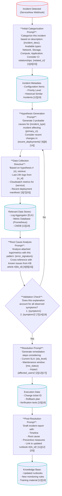

# Flow

```mermaid
flowchart TD
    A[("Incident Detected (ServiceNow Webhook)")] --> B["**Initial Categorization Prompt**: 
    'Categorize this incident based on description: {incident_desc}. 
    Available types: Network, Storage, Compute, Application. 
    Consider CI relationships: {related_ci}' [1][4][15]]"]
    
    B --> C[("Incident Metadata: 
    - Configuration Items
    - Priority Level
    - Historical Similar Incidents [12][19]")]
    
    C --> D["**Hypothesis Generation Prompt**: 
    'Generate 3 probable causes for {incident_type} incident affecting {primary_ci}. 
    Consider recent changes in: {recent_deployments}' [6][8][14]]"]
    
    D --> E["**Data Collection Directive**: 
    'Based on hypothesis #{n}, retrieve: 
    - Last 24h logs from {ci_id} 
    - Cloudwatch metrics for {service} 
    - Recent deployment manifests' [3][7][20]]"]
    
    E --> F[("Relevant Data Stores: 
    - Log Aggregator (ELK)
    - Metric Database (Prometheus)
    - CMDB [12][19]")]
    
    F --> G["**Root Cause Analysis Prompt**: 
    'Analyze attached logs/metrics with this pattern: {error_signature}. 
    Cross-reference with known issues from KB article #{kb_id} [4][9][16]]"]
    
    G --> H{"**Validation Check**: 
    'Does this explanation account for all observed symptoms? 
    1. {symptom1} 
    2. {symptom2}' [7][14][18]"}
    
    H -->|Yes| I["**Resolution Prompt**: 
    'Generate remediation steps considering: 
    - Current SLA: {sla_level} 
    - Maintenance window: {mw_status} 
    - Impact: {affected_users}' [2][12][17]]"]
    
    H -->|No| D
    I --> J[("Execution Data: 
    - Change ticket ID
    - Rollback plan
    - Verification tests [15][19]")]
    
    J --> K["**Post-Resolution Prompt**: 
    'Draft incident report with: 
    - Timeline 
    - Root cause 
    - Preventive measures 
    - Link to updated runbook #{rb_id}' [11][12][20]]"]
    
    K --> L[("Knowledge Base: 
    - Updated runbooks
    - New monitoring rules
    - Training material [12][19]")]
    
    style A stroke:#FF6B6B,stroke-width:2px
    style C stroke:#4ECDC4,stroke-width:2px
    style F stroke:#4ECDC4,stroke-width:2px
    style J stroke:#4ECDC4,stroke-width:2px
    style L stroke:#4ECDC4,stroke-width:2px

```