This file is a merged representation of a subset of the codebase, containing files not matching ignore patterns, combined into a single document by Repomix.
The content has been processed where comments have been removed, empty lines have been removed, content has been compressed (code blocks are separated by ⋮---- delimiter).

# File Summary

## Purpose
This file contains a packed representation of the entire repository's contents.
It is designed to be easily consumable by AI systems for analysis, code review,
or other automated processes.

## File Format
The content is organized as follows:
1. This summary section
2. Repository information
3. Directory structure
4. Repository files (if enabled)
5. Multiple file entries, each consisting of:
  a. A header with the file path (## File: path/to/file)
  b. The full contents of the file in a code block

## Usage Guidelines
- This file should be treated as read-only. Any changes should be made to the
  original repository files, not this packed version.
- When processing this file, use the file path to distinguish
  between different files in the repository.
- Be aware that this file may contain sensitive information. Handle it with
  the same level of security as you would the original repository.

## Notes
- Some files may have been excluded based on .gitignore rules and Repomix's configuration
- Binary files are not included in this packed representation. Please refer to the Repository Structure section for a complete list of file paths, including binary files
- Files matching these patterns are excluded: .gitignore, poetry.lock, LICENSE, **/__init__.py, tests/**, repomix.config.json, .pre-commit-config.yaml
- Files matching patterns in .gitignore are excluded
- Files matching default ignore patterns are excluded
- Code comments have been removed from supported file types
- Empty lines have been removed from all files
- Content has been compressed - code blocks are separated by ⋮---- delimiter
- Files are sorted by Git change count (files with more changes are at the bottom)

# Directory Structure
```
docs/flow.md
issue_helper/agents.py
issue_helper/itsm.py
issue_helper/main.py
issue_helper/models.py
pyproject.toml
README.md
```

# Files

## File: issue_helper/models.py
````python
class ServiceNowIncident(BaseModel)
⋮----
sys_id: str = Field(..., description="Unique incident identifier")
number: str = Field(..., description="Incident number")
short_description: str
description: str
configuration_item: Optional[str]
related_ci: list[str] = []
application: Optional[str]
priority: int
state: int
class AnalysisResult(BaseModel)
⋮----
incident_id: str
agent_name: str
findings: list[str]
recommendations: list[str]
confidence: float
````

## File: README.md
````markdown
# Issue Helper

TODO
````

## File: docs/flow.md
````markdown
# Flow

```mermaid
flowchart TD
    A[("Incident Detected (ServiceNow Webhook)")] --> B["**Initial Categorization Prompt**: 
    'Categorize this incident based on description: {incident_desc}. 
    Available types: Network, Storage, Compute, Application. 
    Consider CI relationships: {related_ci}' [1][4][15]]"]
    
    B --> C[("Incident Metadata: 
    - Configuration Items
    - Priority Level
    - Historical Similar Incidents [12][19]")]
    
    C --> D["**Hypothesis Generation Prompt**: 
    'Generate 3 probable causes for {incident_type} incident affecting {primary_ci}. 
    Consider recent changes in: {recent_deployments}' [6][8][14]]"]
    
    D --> E["**Data Collection Directive**: 
    'Based on hypothesis #{n}, retrieve: 
    - Last 24h logs from {ci_id} 
    - Cloudwatch metrics for {service} 
    - Recent deployment manifests' [3][7][20]]"]
    
    E --> F[("Relevant Data Stores: 
    - Log Aggregator (ELK)
    - Metric Database (Prometheus)
    - CMDB [12][19]")]
    
    F --> G["**Root Cause Analysis Prompt**: 
    'Analyze attached logs/metrics with this pattern: {error_signature}. 
    Cross-reference with known issues from KB article #{kb_id} [4][9][16]]"]
    
    G --> H{"**Validation Check**: 
    'Does this explanation account for all observed symptoms? 
    1. {symptom1} 
    2. {symptom2}' [7][14][18]"}
    
    H -->|Yes| I["**Resolution Prompt**: 
    'Generate remediation steps considering: 
    - Current SLA: {sla_level} 
    - Maintenance window: {mw_status} 
    - Impact: {affected_users}' [2][12][17]]"]
    
    H -->|No| D
    I --> J[("Execution Data: 
    - Change ticket ID
    - Rollback plan
    - Verification tests [15][19]")]
    
    J --> K["**Post-Resolution Prompt**: 
    'Draft incident report with: 
    - Timeline 
    - Root cause 
    - Preventive measures 
    - Link to updated runbook #{rb_id}' [11][12][20]]"]
    
    K --> L[("Knowledge Base: 
    - Updated runbooks
    - New monitoring rules
    - Training material [12][19]")]
    
    style A stroke:#FF6B6B,stroke-width:2px
    style C stroke:#4ECDC4,stroke-width:2px
    style F stroke:#4ECDC4,stroke-width:2px
    style J stroke:#4ECDC4,stroke-width:2px
    style L stroke:#4ECDC4,stroke-width:2px

```


````

## File: issue_helper/agents.py
````python
class BaseAgent
⋮----
def __init__(self, client: genai.Client)
def analyze(self, incident: ServiceNowIncident) -> AnalysisResult
class LinuxInfraAgent(BaseAgent)
⋮----
prompt = f"""
response = self.client.models.generate_content(
⋮----
class WindowsInfraAgent(BaseAgent)
class IncidentAssistant
⋮----
def __init__(self, service_now: ServiceNOW)
def fetch_incident(self, incident_id: str) -> ServiceNowIncident
def analyze_incident(self, incident_id: str) -> dict[str, AnalysisResult]
⋮----
incident = self.fetch_incident(incident_id)
results = {}
````

## File: issue_helper/itsm.py
````python
class ServiceNOW
⋮----
def get_table(self, table: str, params: dict)
⋮----
full_url = f"{self.url}/api/now/table/{table}"
response = self.session.get(full_url, params=params, verify=self.verify)
⋮----
def get_incident(self, incident_id: str) -> ServiceNowIncident
⋮----
result = self.get_table(
records = result.get("result", [])
⋮----
def get_configuration_item(self, incident_id: str) -> Optional[str]
⋮----
incident = self.get_incident(incident_id)
⋮----
def get_application(self, configuration_item: str) -> Optional[str]
⋮----
response = self.get_table(
records = response.get("result", [])
````

## File: issue_helper/main.py
````python
@click.command()
@click.argument("incident")
def main(incident: str)
⋮----
url = "https://your-instance.service-now.com"
username = ("username",)
password = "password"
service_now = ServiceNOW(url=url, username=username, password=password)
assistant = IncidentAssistant(service_now)
results = assistant.analyze_incident(incident)
````

## File: pyproject.toml
````toml
[project]
name = "issue-helper"
version = "0.1.0"
description = ""
authors = [
    { name = "Kamil Urbanek", email = "urbanek.kamil@gmail.com" },
]
requires-python = ">=3.9"

[tool.poetry]
readme = "README.md"
license = "MIT"

[tool.poetry.dependencies]
python = "^3.9"
pydantic = "^2.10.6"
click = "^8.1.8"
requests = "^2.32.3"
google-adk = "^0.5.0"

[tool.poetry.group.dev.dependencies]
pre-commit = "^3.8.0"
pytest = "^8.3.5"
pytest-cov = "^6.1.1"

[project.scripts]
pins = 'issue_helper.main:main'

[build-system]
requires = ["poetry-core>=1.0.0"]
build-backend = "poetry.core.masonry.api"

[tool.ruff]
line-length = 80
exclude = [
    ".bzr",
    ".direnv",
    ".eggs",
    ".git",
    ".git-rewrite",
    ".hg",
    ".ipynb_checkpoints",
    ".mypy_cache",
    ".nox",
    ".pants.d",
    ".pyenv",
    ".pytest_cache",
    ".pytype",
    ".ruff_cache",
    ".svn",
    ".tox",
    ".venv",
    ".vscode",
    "__pypackages__",
    "_build",
    "buck-out",
    "build",
    "dist",
    "node_modules",
    "site-packages",
    "venv",
    "__init__.py",
]

[tool.ruff.lint]
select = [
    "E", # pycodestyle error
    "F", # flake8 error
    "A", # builtin shadowing
    "B", # flake8 bugbear
    "BLE", # aboid bare excepts
    "C4", # simplify comprehensions
    "DTZ", # datetime errors
    "FBT", # avoid boolean trap
    "G", # logging format
    "I", # isort imports
    "N", # conform to PEP8 naming rules
    "RET", # return values
    "S", # bandit
    "TRY", # exceptions antipatterns
    "UP", # upgade syntax
    "W", # pycodestyle warning
    "YTT", # wrong usage of sys.info
#    "ANN003",
#    "ANN001",
#    "ANN201",
#    "D100",
#    "D101",
#    "D103",
]
ignore = [
    "B011",
    "TRY003", # Avoid specifying long messages outside the exception class
    "TRY400", # Use `logging.exception` instead of `logging.error`
    "G004", # Logging statement uses f-string
    "E501",
    "EM102", # Exception must not use an f-string literal, assign to variable first
    "S311",  # Standard pseudo-random generators are not suitable for cryptographic purposes
    "D100",  # Missing docstring in public module
    "TRY300", # Consider moving this statement to an `else` block
    "FBT001",  # Boolean-typed positional argument in function definition
    "FBT002",  # Boolean default positional argument in function definition
    "BLE001",  # Do not catch blind exception: `Exception`
]


[tool.ruff.format]
docstring-code-format = true
docstring-code-line-length = 72


[tool.ruff.lint.per-file-ignores]
"__init__.py" = ["E402"]
"**/{tests,docs,scripts}/*" = [
    "E402",
    "ANN",  # Missing type annotation for function argument
    "S101",  # Use of `assert` detected
    "D",  # Missing docstring in public function
]

[tool.pytest.ini_options]
minversion = "8.0"
````
